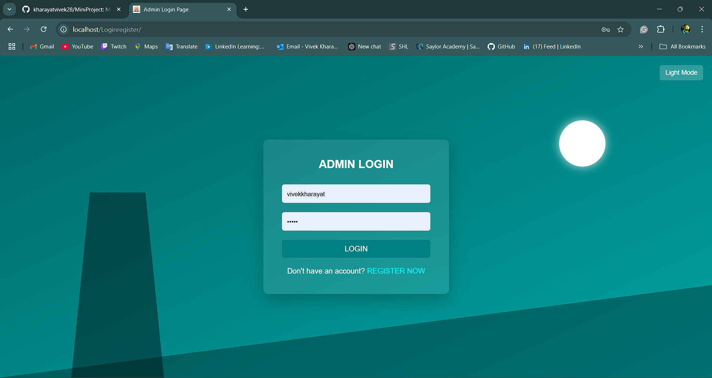
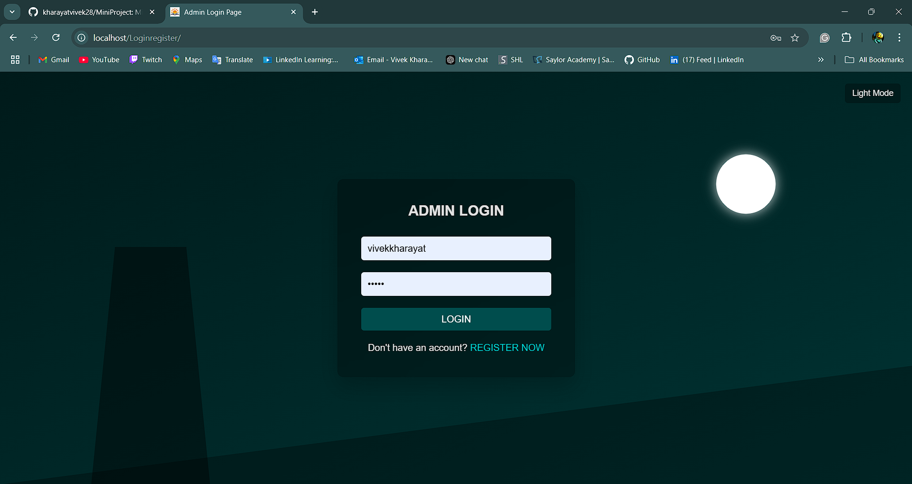
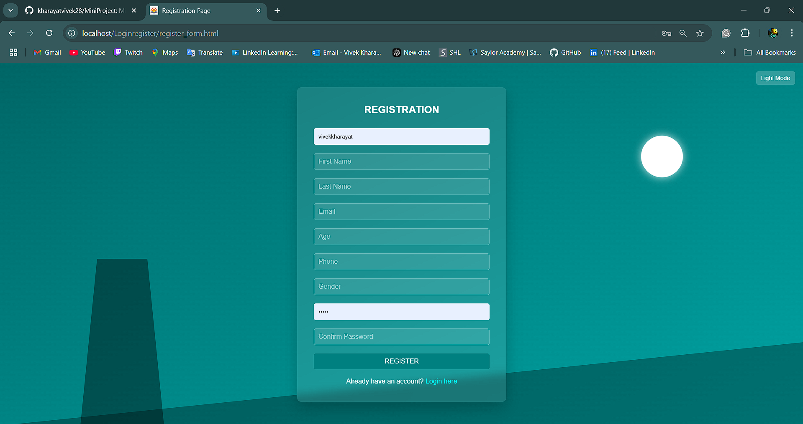
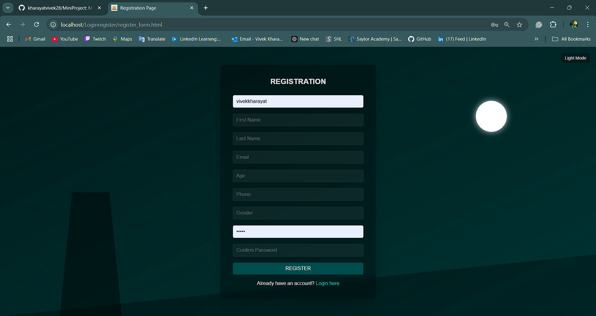
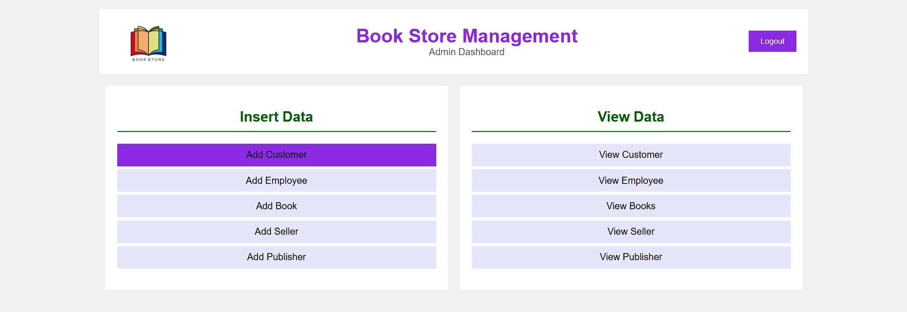
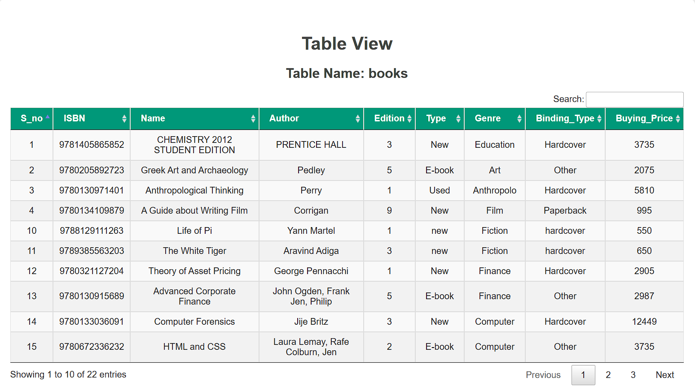
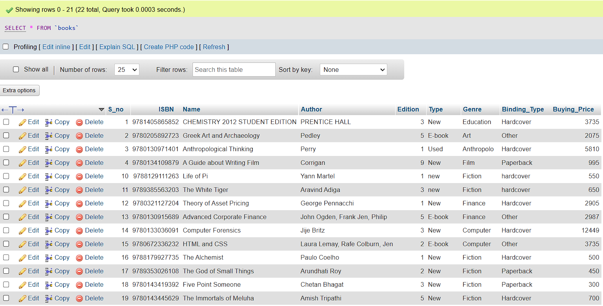

# Mini Project(Web Programming & PLSQL Lab)

## Bookstore Management Admin Dashboard
1. Languages and Technologies: 
   • PHP: For backend development and database connection. 
   • SQL: For database management. 
   • HTML/CSS: For creating the frontend interface and ensuring user interactivity. 
   • JavaScript: For additional interactivity or validation. 

<h3>Setup Details:</h3> 
<i><u>Prerequisites</u></i>  
XAMPP installed (for Apache server and MySQL database). 
VS Code or any text editor (based on your preference for development). 

1. Create a Database: user_authentication, 
2. Create tables using the SQL Queries given in the Database Folder. 
3. Run the project using localhost/foldername...for eg: localhost/Loginregister 

<h3>Output</h3> 
<h3> You can see all the Output Screenshots from the Output Folder. Below attached are some of them</h3> 
Admin Login Page

  
DarkMode Admin Login Page

  
Registration Page

  
DarkMode Registration

  
Dashboard Page

  
DataFlow Diagram

  
View Page

  
Data Stored in Database

  
